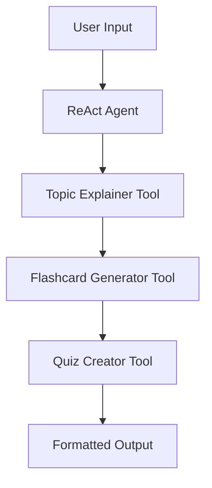

# 🎓 LangGraph Educational Assistant

A powerful AI-powered educational tool built with LangGraph that creates comprehensive learning materials including topic explanations, flashcards, and quizzes. This project demonstrates how to build multi-agent workflows using LangGraph and OpenAI's GPT models.

## 🌟 Features

- **📚 Topic Explanation**: Generate clear, concise explanations of any topic
- **🃏 Flashcard Generation**: Create study flashcards based on the explanations
- **❓ Quiz Creation**: Generate quizzes with multiple-choice and short answer questions
- **🔄 Multi-Agent Workflow**: Coordinated agents working together seamlessly
- **📊 Structured Output**: Well-formatted, engaging content with emojis and clear sections

## 🚀 Demo

Input: "Explain the water cycle"

Output:
```
📘 **Concept Explanation**
[Detailed explanation of the water cycle...]

🃏 **Flashcards**
[5 flashcards with questions and answers...]

❓ **Quiz**
[5 quiz questions with multiple choice and short answers...]
```

## 🛠️ Installation

### Prerequisites

- Python 3.8+
- OpenAI API Key
- pip package manager

### Setup

1. **Clone the repository**
   ```bash
   git clone https://github.com/yourusername/langgraph-educational-assistant.git
   cd langgraph-educational-assistant
   ```

2. **Install dependencies**
   ```bash
   pip install -r requirements.txt
   ```

3. **Set up environment variables**
   
   Create a `.env` file in the root directory:
   ```env
   OPENAI_API_KEY=your_openai_api_key_here
   ```

4. **Run the application**
   ```bash
   python main.py
   ```

## 📁 Project Structure

```
langgraph-educational-assistant/
├── main.py                    # Main application file
├── tools/
│   ├── topic_explainer.py     # Topic explanation tool
│   ├── flashcard_generator.py # Flashcard generation tool
│   ├── quiz_creator.py        # Quiz creation tool
│   ├── current_date.py        # Date utility tool
│   └── addition.py            # Math utility tool
├── requirements.txt           # Python dependencies
├── .env.example              # Environment variables template
└── README.md                 # This file
```

## 🔧 Configuration

### Environment Variables

| Variable | Description | Required |
|----------|-------------|----------|
| `OPENAI_API_KEY` | Your OpenAI API key | Yes |

### Model Configuration

By default, the application uses `gpt-4o-mini`. You can change this in `main.py`:

```python
model = ChatOpenAI(
    model="gpt-4o-mini",  # Change to gpt-4, gpt-3.5-turbo, etc.
    openai_api_key=OPENAI_API_KEY
)
```

## 🎯 Usage

### Basic Usage

```python
from main import create_educational_content

# Generate content for any topic
content = create_educational_content("photosynthesis")
print(content)
```

### Custom Prompts

Modify the prompt in `main.py` to customize the output format:

```python
HumanMessage(content="""
Your custom prompt here...
""")
```

### Adding New Tools

1. Create a new tool file in the `tools/` directory
2. Implement the tool following the LangChain tool interface
3. Add it to the tools list in `main.py`

## 🏗️ Architecture

This project uses **LangGraph** to orchestrate multiple AI agents:

### Components

- **🧠 ReAct Agent**: Coordinates the workflow and tool usage
- **🔧 Tools**: Specialized functions for different tasks
- **📊 State Management**: Maintains context across tool calls
- **🔄 Streaming**: Real-time response processing

### Workflow



## 📋 Requirements

```txt
langchain-openai>=0.1.0
langgraph>=0.1.0
python-dotenv>=1.0.0
langchain-core>=0.2.0
```

## 🤝 Contributing

Contributions are welcome! Please follow these steps:

1. Fork the repository
2. Create a feature branch (`git checkout -b feature/amazing-feature`)
3. Commit your changes (`git commit -m 'Add amazing feature'`)
4. Push to the branch (`git push origin feature/amazing-feature`)
5. Open a Pull Request

### Development Setup

```bash
# Install development dependencies
pip install -r requirements-dev.txt

# Run tests
python -m pytest

# Run linting
flake8 .

# Format code
black .
```

## 🐛 Troubleshooting

### Common Issues

**1. API Key Issues**
```
Error: OpenAI API key not found
```
**Solution**: Ensure your `.env` file contains a valid `OPENAI_API_KEY`

**2. Empty Output**
```
Output sections are empty
```
**Solution**: Check that your custom tools are properly implemented and returning content

**3. Streaming Issues**
```
Chunks not processed correctly
```
**Solution**: Verify the chunk structure matches your parsing logic

### Debug Mode

Enable debug mode to see detailed chunk information:

```python
# Add this to main.py for debugging
import logging
logging.basicConfig(level=logging.DEBUG)
```

## 📚 Examples

### Example 1: Science Topic
```python
# Topic: Photosynthesis
# Output: Explanation + 5 flashcards + 5 quiz questions
```

### Example 2: History Topic
```python
# Topic: World War II
# Output: Comprehensive learning materials
```

### Example 3: Custom Format
```python
# Modify the prompt to generate different formats
# Add more tools for extended functionality
```

## 🌐 API Reference

### Tools

#### TopicExplainerTool
Generates clear explanations of any topic.

#### FlashcardGeneratorTool
Creates study flashcards with questions and answers.

#### QuizCreatorTool
Generates quizzes with multiple question types.

## 📈 Performance

- **Response Time**: ~10-30 seconds depending on topic complexity
- **Token Usage**: Optimized for cost-effective API usage
- **Scalability**: Easily extensible with new tools and agents

## 📄 License

This project is licensed under the MIT License - see the [LICENSE](LICENSE) file for details.

## 🙏 Acknowledgments

- [LangGraph](https://github.com/langchain-ai/langgraph) for the multi-agent framework
- [OpenAI](https://openai.com) for the powerful language models
- [LangChain](https://github.com/langchain-ai/langchain) for the foundational tools

## 📞 Support

- **Issues**: [GitHub Issues](https://github.com/yourusername/langgraph-educational-assistant/issues)
- **Discussions**: [GitHub Discussions](https://github.com/yourusername/langgraph-educational-assistant/discussions)
- **Email**: your.email@example.com

---

⭐ **Star this repository if you find it helpful!** ⭐

Made with ❤️ and 🤖 by [Your Name]
